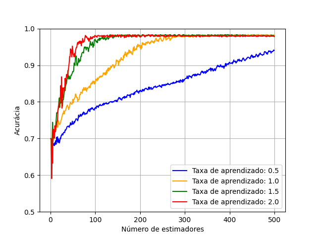

# Aprendizado de máquina - Trabalho prático 2.

## Visão geral do repositório.
A linguaguem escolhida para fazer a implementação foi o Rust, isso por conta dele ser uma linguagem
moderna, prática e tão rápida quanto C/C++. 

Bindings são criados para se poder utilizar a biblioteca
desenvolvida em Rust dentro de um script Python. Nesse script (main.py) são realizados os experimentos
solicitados.

A documentação da implementação foi publicada utilizando as ferramentas de documentação nativas do Rust, 
através do comando 'cargo doc'.

## Documentação da implementação.
A página se encontra em: https://victorhenrique317.github.io/ml-tp2/adaboost_bindings/index.html.

## Análises de erro.
Realizei minha análise de erros da seguinte maneira: para cada valor de taxa de aprendizado no intervalo [0.5, 1.0, 1.5, 2.0], plotei um gráfico mostrando a Acurácia Simples em função do número de classificadores fracos (iterações). Os valores de acurácia foram registrados seguindo uma metodologia de validação cruzada com 5 partições.

Com isso, foi possível observar como o número de classificadores fracos e a taxa de aprendizado influenciam na convergência do algoritmo.

A análise do gráfico mostra que o número de estimadores é um fator essencial para o bom desempenho do modelo, validando assim a corretude do meu processo de boosting. A alta acurácia atingida na convergência indica que a implementação foi realizada corretamente, uma vez que tais valores já foram comprovados como possíveis para esse conjunto de dados.

Além disso, a taxa de aprendizado é um fator importante na velocidade de convergência do boosting. Com base nesses resultados, podemos afirmar que uma taxa ideal seria de 1.5 (verde), pois ela converge aproximadamente para o mesmo número de estimadores que a taxa mais alta (vermelha), e ao mesmo tempo não apresenta tanta instabilidade durante seu percurso.